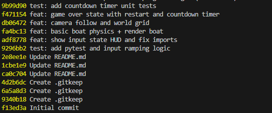
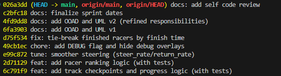

# Sprint planning bewijs

## Sprint 1 (datum: 15-01-2026 t/m 17-01-2026)

## Bewijs

**Doel:** project opzetten + basis gameplay loop + input + tests  
**Backlog (kort):**

- Repo + venv + pygame run
- Input ramping (TDD)
- Boat physics + render
- Timer + game over (TDD)
  **Bewijs:** zie screenshots hieronder

## Sprint 2 (datum: 18-01-2026 t/m 20-01-2026)

## Bewijs

**Doel:** track + ranking + bots + win-conditie + bugfixes  
**Backlog (kort):**

- Track/checkpoints (TDD)
- Ranking/positie (TDD)
- Bot AI + anti-stacking
- Win-conditie + tie-breaker
- Debug cleanup + tuning controls
  **Bewijs:** zie screenshots hieronder
